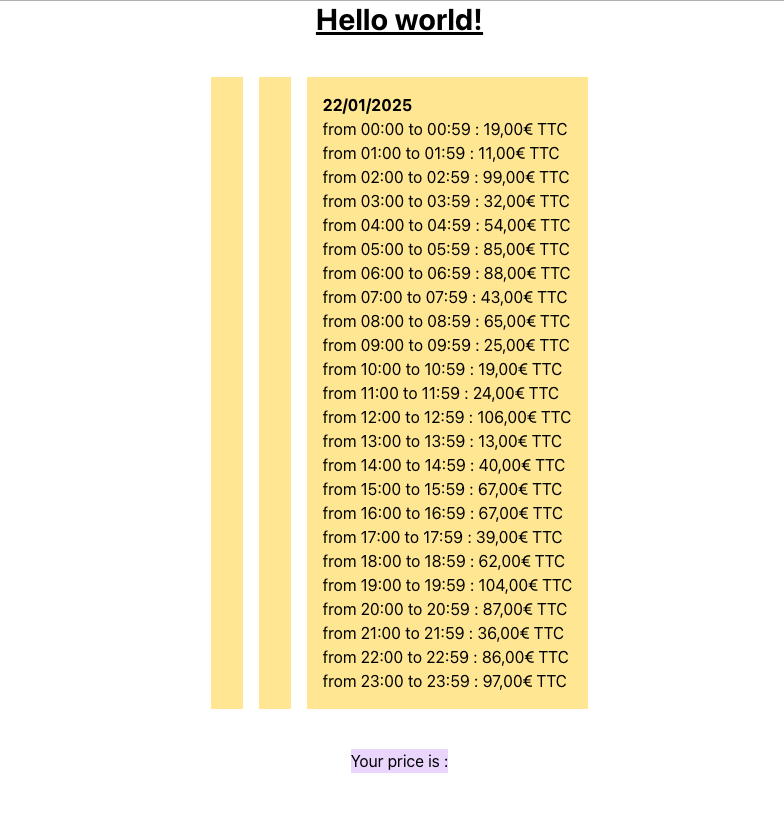

# Getting started

## With local NodeJS

```shell
npm i
npm run start
```

## With Docker Compose

```shell
cd docker
docker-compose up -d
```

## Open in browser

open [localhost:3001](http://localhost:3001)

You should see a screen resembling this one :



# Test (60 minutes)

1. BUG : Le jour 1 et 2 ne s’affichent pas, corrigez l’affichage des jours du calendrier.
2. FEAT : Faire défiler les jours à l’aide de deux boutons de part et d’autre du calendrier. On ne peut pas aller dans le passé. À chaque changement de jour, recalculer les prix des 3 jours pour le moment.
3. FEAT : Rendre un slot du calendrier sélectionnable par l’utilisateur. Réaliser une intégration minimaliste, mais fonctionnelle, avec Tailwind.
4. FEAT : Répercuter le prix du slot sélectionné par l’utilisateur dans le ticket.
5. FEAT : Propager l’état de chargement dans le ticket.
6. FEAT : Rendre l’affichage responsive. Passé un breakpoint arbitraire, l’affichage doit basculer entre 1 jour affiché vs 3 jours affichés.
7. FEAT : Ne relancer les requêtes que pour les colonnes affichées

# Bonus
8. FEAT : Inclure une probabilité d’erreur dans la fonction de récupération des données et maîtriser son impact.
9. FEAT : Ne pas recalculer les jours déjà calculés.
10. FEAT : Créer un bouton au-dessus du calendrier “change parameters” qui aura pour effet de forcer le re-calcul du prix pour les jours affichés et réinitialiser tous les autres jours.
